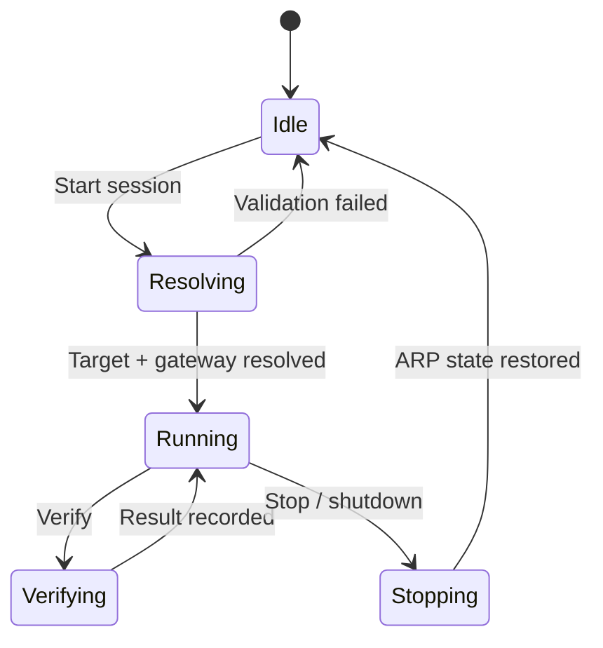
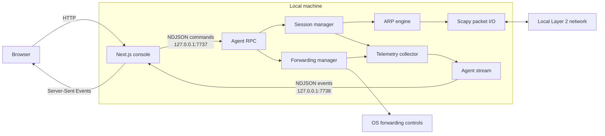

<a id="readme-top"></a>

<div align="center">

# LAZYNET

### ARP visibility without the terminal sprawl.

**A focused operator console for controlled Layer 2 network labs.**  
Discover interfaces, run and verify ARP sessions, inspect traffic, and recover cleanly—all from one local dashboard.

[](https://github.com/Cyber0x3a/lazynet)
[](https://www.python.org/)
[](https://nextjs.org/)
[](https://react.dev/)
[](https://scapy.net/)
[](#system-requirements)

[Overview](#overview) · [Quick start](#quick-start) · [Operation](#operation) · [Architecture](#architecture) · [Configuration](#configuration) · [Troubleshooting](#troubleshooting)

</div>

---

> [!CAUTION]
> **LazyNet changes ARP state and can intercept or disrupt network traffic.** Use it only on systems and networks you own or are explicitly authorized to test. An isolated lab, test VLAN, or disposable virtual environment is strongly recommended. Unauthorized interception may be illegal.

## Overview

LazyNet turns a low-level ARP testing workflow into an observable, controlled session. The Python agent owns the privileged network work; the Next.js console owns interaction and presentation. The result is a tool that is easy to operate without hiding what is happening underneath.

| Observe | Control | Recover |
| :--- | :--- | :--- |
| Live RX/TX throughput | One-way or two-way sessions | Corrective ARP replies on stop |
| Per-protocol traffic mix | Interface and timing selection | Forwarding state reconciliation |
| Searchable packet records | Manual or automatic verification | Signal-aware graceful shutdown |
| Structured event history | Windows UAC / Linux `sudo` elevation | Bounded telemetry buffers |

### Why LazyNet

- **One surface, full lifecycle.** Start, inspect, verify, and stop from the same dashboard.
- **Observable by default.** Packet activity, protocol distribution, forwarding state, and agent events remain visible throughout a session.
- **Safe operational boundaries.** Self-target protection, bounded logs, privilege checks, loopback-only IPC, and restorative ARP traffic are built into the workflow.
- **Minimal moving parts.** No database, message broker, cloud account, or third-party IPC service is required.
- **Useful below the UI.** The ARP engine can be imported directly, while the agent exposes a documented NDJSON protocol for other local clients.

## Console at a glance

```text
┌─ SIGNAL PATH ────────────────────────────────────┬─ VERIFICATION ───────┐
│                                                 │                      │
│   [ TARGET ]  ⇄  [ LAZYNET ]  ⇄  [ GATEWAY ]   │  method   auto       │
│                   forwarding                    │  status   verified   │
│                                                 ├─ PROTOCOL MIX ───────┤
├─ LIVE READOUTS ─────────────────────────────────┤  TCP  ███████░  71%  │
│  RX rate       TX rate       packets       ARP  │  UDP  ███░░░░░  24%  │
├─ THROUGHPUT ────────────────────────────────────┤  ...                 │
│         ╭──╮       ╭────╮                       ├─ EVENT LOG ───────────┤
│  ───────╯  ╰───────╯    ╰────────               │  session started     │
├─ PACKET LOG ────────────────────────────────────┤  forwarding enabled  │
│  time      source        destination   protocol │  verification passed │
└─────────────────────────────────────────────────┴──────────────────────┘
```

The actual console is responsive: the inspector collapses beneath the main workspace on smaller displays, and its desktop width can be resized and persisted locally.

## Quick start

### System requirements

| Requirement | Supported / recommended |
| :--- | :--- |
| Operating system | Windows 10/11 or a modern Linux distribution |
| Python | 3.10 or newer |
| Node.js | 18.18 or newer |
| Network position | Same Layer 2 network as the target and gateway |
| Privileges | Administrator/root for raw sockets and IP forwarding |
| Windows capture driver | [Npcap](https://npcap.com/) with WinPcap API compatibility enabled |

### 1 · Clone

```bash
git clone https://github.com/Cyber0x3a/lazynet.git
cd lazynet
```

### 2 · Prepare the Python agent

<details open>
<summary><strong>Windows / PowerShell</strong></summary>

```powershell
python -m venv .venv
.\.venv\Scripts\Activate.ps1
python -m pip install --upgrade pip
python -m pip install -r requirements.txt
```

</details>

<details>
<summary><strong>Linux</strong></summary>

```bash
python3 -m venv .venv
source .venv/bin/activate
python -m pip install --upgrade pip
python -m pip install -r requirements.txt
```

</details>

### 3 · Start the console

```bash
cd web
npm install
npm run dev
```

Open **[localhost:3000](http://localhost:3000)**.

That is the complete development setup. The console discovers the repository-level virtual environment, starts the Python agent on demand, and adopts an existing agent when one is already listening. Privileged actions request UAC or `sudo` elevation when required.

> [!IMPORTANT]
> Keep the server terminal open while operating LazyNet. Stop it with <kbd>Ctrl</kbd> + <kbd>C</kbd> so the console can request a clean agent shutdown and restore network state.

## Operation

### Session lifecycle



1. **Check readiness.** Confirm the header reports the agent online and forwarding on.
2. **Start a session.** Provide the target IPv4 address, gateway IPv4 address, direction, interface, and interval.
3. **Approve elevation.** LazyNet relaunches the agent with the required rights if it is not already privileged.
4. **Observe.** Follow the topology, throughput, protocol mix, packet records, and structured events in real time.
5. **Verify.** Use automatic, passive, or active verification to confirm the expected network behavior.
6. **Stop cleanly.** LazyNet halts the scheduler, sends corrective ARP replies, and reconciles forwarding state.

### Session modes

| Mode | Behavior | Typical use |
| :--- | :--- | :--- |
| **Two-way** | Updates the ARP caches of both target and gateway | Full controlled MITM lab path |
| **One-way** | Updates the target-side ARP cache only | Narrow experiments and demonstrations |

### Verification

| Method | What it checks |
| :--- | :--- |
| `auto` | Selects the most appropriate available verification path |
| `passive` | Listens for traffic evidence without transmitting a probe |
| `active` | Performs an active check within the configured timeout |

### Direct Python usage

The UI is optional. The engine exposes a small Python API for scripts and experiments:

```python
import time

from lib import ARPConfig, ARPPoisoningEngine

config = ARPConfig(
    target_ip="192.168.1.50",
    gateway_ip="192.168.1.1",
    direction="two-way",
)

with ARPPoisoningEngine(config) as engine:
    time.sleep(15)
    result = engine.verify(timeout=5)
    print(result.detail)
```

Run direct scripts from the repository root with administrator/root privileges. The context manager guarantees the normal stop-and-restore path when the block exits.

## Architecture



### Component boundaries

| Component | Responsibility |
| :--- | :--- |
| `web/src/app` | Next.js pages plus the HTTP/SSE bridge |
| `web/src/features` | Console, controls, visualizations, logs, and settings UI |
| `web/src/lib` | Agent process ownership, RPC client, state stores, and types |
| `agent` | Long-running RPC, stream, session, telemetry, settings, and elevation services |
| `lib/arp` | ARP configuration, scheduler, poisoning engine, restoration, and verification |
| `lib/shared` | Interface discovery, forwarding, packets, addressing, and shared helpers |

### Local IPC

LazyNet uses newline-delimited JSON over loopback TCP. There is no external message broker and neither agent socket binds to a LAN interface.

| Channel | Default endpoint | Direction | Purpose |
| :--- | :--- | :--- | :--- |
| Command | `127.0.0.1:7737` | Console → agent | Request/response RPC |
| Stream | `127.0.0.1:7738` | Agent → console | Metrics, events, session, and forwarding updates |

Every command and stream connection must carry the shared token. The full request, response, event, and data-shape specification lives in **[CONTRACT.md](CONTRACT.md)**.

<details>
<summary><strong>Supported RPC commands</strong></summary>

| Domain | Commands |
| :--- | :--- |
| Agent | `agent.ping`, `agent.status`, `agent.elevate`, `agent.shutdown` |
| Interfaces | `interfaces.list` |
| Sessions | `session.start`, `session.stop`, `session.verify` |
| Forwarding | `forwarding.set` |
| Telemetry | `metrics.snapshot`, `packets.list`, `events.list` |
| Settings | `config.get`, `config.set` |

</details>

## Configuration

### Environment

| Variable | Default | Description |
| :--- | :--- | :--- |
| `LAZYNET_CMD_PORT` | `7737` | Agent command RPC port |
| `LAZYNET_STREAM_PORT` | `7738` | Agent event stream port |
| `LAZYNET_TOKEN` | `lazynet-dev` | Shared local authentication token |

Environment values set before `npm run dev` are inherited by the automatically managed agent:

```powershell
$env:LAZYNET_TOKEN = "a-long-random-local-secret"
cd web
npm run dev
```

```bash
export LAZYNET_TOKEN="a-long-random-local-secret"
cd web
npm run dev
```

> [!NOTE]
> The built-in token is intended for isolated development. Replace it on shared machines. LazyNet IPC is authenticated but not encrypted; its protection comes from binding exclusively to `127.0.0.1`.

### Persisted settings

Settings are deep-merged and saved atomically to `~/.lazynet/settings.json`.

| Section | Controls |
| :--- | :--- |
| `attack` | Direction, poison interval, verification timeout, automatic verification |
| `safety` | Self-check, automatic forwarding, ARP restoration |
| `interface` | Preferred adapter |
| `telemetry` | Metric retention, packet limit, event limit |
| `ui` | Density, refresh interval, reduced motion, time format |

### Standalone agent

The console normally owns the agent lifecycle. For debugging or integration work, run it independently from the repository root:

```bash
python -m agent --log-level DEBUG
```

```text
--cmd-port PORT       Override the command socket port
--stream-port PORT    Override the stream socket port
--token TOKEN         Override the shared authentication token
--log-level LEVEL     DEBUG | INFO | WARNING | ERROR
```

If the configured command port is already occupied by a LazyNet agent, the console adopts that process rather than spawning a duplicate.

## Build and validation

Create and serve an optimized console build from `web/`:

```bash
npm run build
npm start
```

Run `npm start` from the `web` directory so the process manager can resolve the repository root and `.venv` correctly.

The repository does not currently include an automated test suite. The practical validation path is:

```bash
cd web
npm run build
cd ..
python -m agent --log-level DEBUG
```

Use <kbd>Ctrl</kbd> + <kbd>C</kbd> to exercise the agent's graceful shutdown path.

## Troubleshooting

<details open>
<summary><strong>The console reports “agent offline”</strong></summary>

- Start Next.js from the `web` directory.
- Confirm `.venv` exists at the repository root and `requirements.txt` is installed into it.
- Read the Next.js terminal output for the agent's startup error.
- Confirm ports `7737` and `7738` are not held by an unrelated process.

</details>

<details>
<summary><strong>Windows shows no interfaces or captured packets</strong></summary>

- Install Npcap with **WinPcap API compatibility** enabled.
- Restart the terminal—or Windows—after installing the driver.
- Approve the UAC prompt when LazyNet requests elevation.
- Confirm the selected adapter has a non-loopback IPv4 address and a valid MAC address.

</details>

<details>
<summary><strong>IP forwarding remains off</strong></summary>

- Confirm the agent is running with administrator/root privileges.
- On Linux, confirm `sysctl` is available and the host permits changes to `net.ipv4.ip_forward`.
- On managed Windows systems, check whether group policy blocks registry or `netsh` forwarding changes.
- Review the event log: the forwarding manager records failures without hiding them from the session.

</details>

<details>
<summary><strong>The target loses connectivity</strong></summary>

- Stop the session in the console and wait for the restoration event.
- Confirm forwarding remained enabled during the active session.
- If the process was forcibly terminated, clear stale ARP entries on the affected lab hosts or wait for their caches to expire.
- Restart LazyNet only after the network returns to a known state.

</details>

<details>
<summary><strong>Elevation was declined or timed out</strong></summary>

The unprivileged console remains usable, but packet injection and forwarding cannot operate. Start the agent in an elevated shell with `python -m agent`, then launch the console; it will detect and adopt the existing agent.

</details>

## Safety model

LazyNet reduces operational risk; it cannot make an unsafe target safe.

- Agent sockets bind to loopback only.
- A token is required for commands and stream subscriptions.
- Target and gateway self-checks prevent accidental self-poisoning by default.
- Only one verification job can run at a time.
- Telemetry, packet, and event storage are bounded in memory.
- Session stop sends corrective ARP traffic to both peers when restoration is enabled.
- Signal handling routes <kbd>Ctrl</kbd> + <kbd>C</kbd>, `SIGINT`, and `SIGTERM` through cleanup.
- Forwarding is disabled on shutdown only when LazyNet enabled it.

Abrupt power loss, forced process termination, driver failure, or operating-system policy can still bypass cleanup. Use an isolated environment and maintain an independent recovery path.

---

<div align="center">

**LazyNet** · local-first network lab instrumentation  
Python · Scapy · Next.js · React · TypeScript

<sub>Operate deliberately. Observe everything. Leave the network clean.</sub>

<br />

<a href="#readme-top">Back to top ↑</a>

</div>
